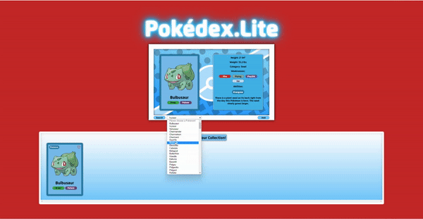

# Pokedex.Lite

## Description

Welcome to Pokédex.Lite! This single page application is a rendition of a Pokédex that supports all 151 Indigo League Pokémon. Users are able to search for Pokémon from a dropdown menu and see all stats relevant to that Pokémon on the Pokédex interface. Users can hover over the ability icons to see additional information about that Pokémon's abilities. Users are able to add Pokémon cards to their collection, favorite their favorite Pokémon, and remove Pokémon from their collection if they so choose.

## Table of Contents

- [Installation](#installation)
- [Usage](#usage)
- [Documentation](#documentation)
- [Credits](#credits)
- [License](#license)
- [Changelog](#changelog)
- [Support](#support)

## Installation

In order to access this project, please fork your own version in the top right of the GitHub Repository. Once you've forked a copy, please clone the repository to your own directory. All data in this projects JSON is unique to this project, and it does not pull data from an API. As such, anyone wanting to view this project in its entirety will need JSON Server installed into their desired directory in order to render data from the index.json file to the DOM. Once JSON Server is installed and running, open index.html in your web browser and play around with the app! It is recommended to view this app in a full screen window, as CSS compatibility for different screen resolutions has not been implemented at this time.

## Usage

Please ensure you have your JSON Server running in your desired directory before attempting to utilize this web application, as it will not pull any data into the webpage without it. After that, your first stop is going to be the dropdown menu: select any Pokémon from the drop down menu and click "Search." You should see that Pokémon's card alongside all relevant Pokémon stats. Hovering over the Pokémon's ability will display an overlay with an additional description of that specific ability. Step two is to click the "Add" button to add that Pokémon to your collection! Once the Pokémon has been added, you should see a direct change in the JSON file under the "collection" root. From here, you can click the heart icon to favorite the Pokémon, or if you would like the remove a Pokémon you can click "Remove" and then select Ok on the alert prompt. All changes made to the collection will be persisted on page refresh!

## Documentation

For a high level overview of this projects original repository files, as well as an overview of how to use the web application, please go to https://www.youtube.com/watch?v=49jjiAZRRHM

## Contributing

Anyone interested in this project is free to fork and clone their own copy, and submit changes or feature implementations to be approved by me. Please ensure all features are fully tested and debugged before submitting them for implementation.

## Credits

All Pokémon images, stats, ability information, types, weaknesses, and descriptions were sourced from the official Pokémon website: https://www.pokemon.com/us/pokedex

All other elements were sourced from Google Images. I do not own the rights to any images in this project and, as such, do not condone the use of this project outside of personal use.

## License

MIT License

Copyright (c) 2023 Brian Ashman

Permission is hereby granted, free of charge, to any person obtaining a copy
of this software and associated documentation files (the "Software"), to deal
in the Software without restriction, including without limitation the rights
to use, copy, modify, merge, publish, distribute, sublicense, and/or sell
copies of the Software, and to permit persons to whom the Software is
furnished to do so, subject to the following conditions:

The above copyright notice and this permission notice shall be included in all
copies or substantial portions of the Software.

THE SOFTWARE IS PROVIDED "AS IS", WITHOUT WARRANTY OF ANY KIND, EXPRESS OR
IMPLIED, INCLUDING BUT NOT LIMITED TO THE WARRANTIES OF MERCHANTABILITY,
FITNESS FOR A PARTICULAR PURPOSE AND NONINFRINGEMENT. IN NO EVENT SHALL THE
AUTHORS OR COPYRIGHT HOLDERS BE LIABLE FOR ANY CLAIM, DAMAGES OR OTHER
LIABILITY, WHETHER IN AN ACTION OF CONTRACT, TORT OR OTHERWISE, ARISING FROM,
OUT OF OR IN CONNECTION WITH THE SOFTWARE OR THE USE OR OTHER DEALINGS IN THE
SOFTWARE.

## Changelog

V.1.0.0 - Initial Version adds full functionality to the app, with opportunity to implement additional features at a later date.

## Support

If there are any questions regarding this project, please feel free to reach out to me via email at brythewiseguy@gmail.com